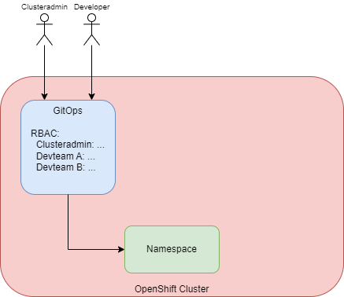
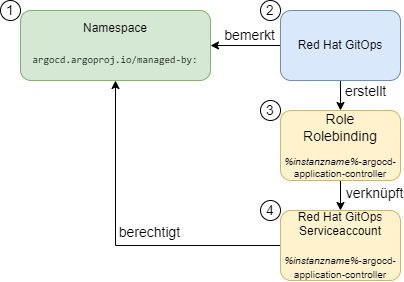
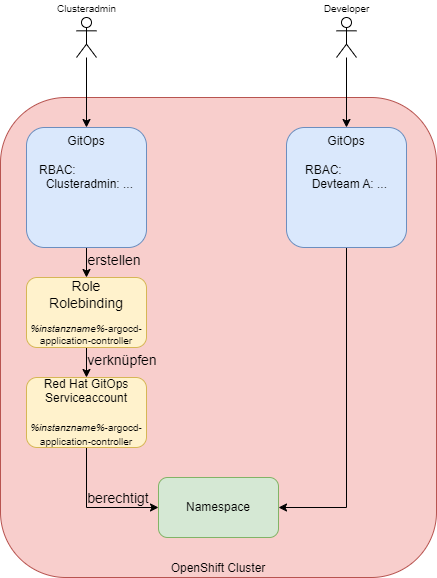
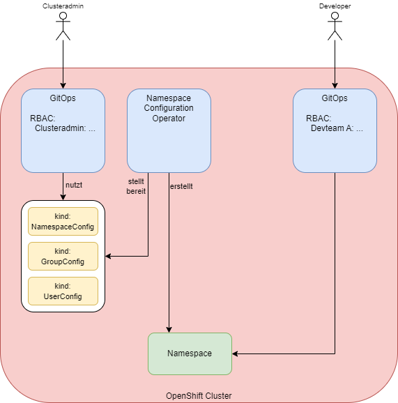

= Managing Namespaces with Red hat GitOps
:toc:

In diesem Repository befinden sich Möglichkeiten, um Namespaces mit Red Hat GitOps zu managen.

== Vorwort

Grundsätzlich kann man Namespaces mit Red Hat GitOps erstellen. Entweder, insbesondere bei einer älteren Operatorversion, indem man diese als Ressource in einer YAML-Datei deklariert und diese mit Red Hat GitOps ausrollte oder, bei einer neuen Operatorversion, indem man die Erstellung des Namespaces einfach in der Syncoptionen der Argo-Application angibt. Der Unterschied zwischen den Operatorversionen ist, dass man nur in den neuen bei der Syncoption auch Labels und Annotations direkt mitgeben kann, diese aber wichtig sind, damit der Namespace anschließend auch von Red Hat GitOps verwaltet werden kann, da die Berechtigung über ein Label gesetzt werden.

In der Regel haben wir aber getrennte Gruppen, welche auf einem OpenShift Server unterwegs sind. Das sind einerseits die Clusteradministratoren und andererseits die Developerteams.

Problematisch kann es nun werden, wenn sowohl die Clusteradministratoren als auch die Developerteams Red Hat GitOps verwenden möchten. Denn auf einmal möchten zwei verschiedene Gruppen auf die gleichen Namespaces zugreifen, um dort jeweils ihre Konfigurationen zu hinterlegen. Die Clusteradmins möchten beispielsweise Ressourcequotas, Limitranges oder Networkpolicies im Namespace konfigurieren und die Developer möchten ihrerseits natürlich Deployments, Configmaps, Routen und mehr konfigurieren.

== Option 1: Nur eine Red hat GitOps Instanz

Diese Option klingt zunächst leicht, ist sie aber nicht, da sie schwierig zu konfigurieren ist. Natürlich kann man nur eine Instanz von Red Hat GitOps installieren und dort über RBAC die Berechtigungen trennen, so dass Developerteams nur Zugriff auf ihre jeweiligen Argo-Applikationsprojekte haben.

CAUTION: Das Problem lauert aber an einer anderen Stelle. Wenn wir nur eine GitOps-Instanz haben, dann haben wir auch nur einen dahinterliegenden GitOps-Serviceaccount mit den entsprechenden Berechtigungen in dem Namespace. Und wenn ein Developerteam GitOps verwendet, dann werden die Ressourcen nicht mit den Berechtigungen des Developers, sondern mit den Berechtigungen des GitOps-Serviceaccounts erstellt. Hat also der Clusteradmin die Möglichkeit, über GitOps eine Networkpolicy auszurollen, dann hat der Developer das in seinem Namespace ebenso.

Nun kann man dies noch über die Argo-Applikationsprojekte lösen, denn dort lässt sich konfigurieren, welche Art von Kubernetesobjekten wie z.B. "NetworkPolicy" erstellt werden dürfen und welche nicht. Ebenso lässt sich konfigurieren, in welchen Namespaces die Berechtigungen gelten. Diese Konfiguration muss aber sehr bedacht vorgenommen werden, damit am Ende die Berechtigungen korrekt sind.

Wenn man jedoch unterschiedliche Instanzen von Red Hat GitOps einsetzen möchte oder dies gar eine Securityanforderung ist, muss man anders vorgehen. Hierfür sind die beiden folgenden Optionen gedacht.

== Option 2: Getrennte Instanzen und Konfiguration der Instanzberechtigungen

Wenn man getrennte Instanzen von Red Hat GitOps einsetzt, stösst man auf ein Problem. Über ein Label "argocd.argoproj.io/managed-by:" wird in einem Namespace angegeben, welche Instanz diesen Namespace verwaltet. Daher hat erst einmal nur eine Instanz von Red Hat GitOps die Berechtigung, auf den Namespace zuzugreifen.

NOTE: Diese Option habe ich bisher nicht getestet, es dürfte aber keine technischen Probleme geben.

Wenn man nun beide Instanzen berechtigen möchte, auf einen Namespace zuzugreifen, muss man wissen, was hinter den Kulissen passiert, wenn ein Namespace ein entsprechendes Label erhält.

Wenn ein Namespace mit dem entsprechenden Label erstellt wird, bermerkt GitOps dies und erstellt im Normalfall eine Rolle und ein Rolebinding für den Serviceaccount des ArgoCD-Application-Controllers. Diese beiden Ressourcen sind an den Namespace gebunden, so dass GitOps darüber Zugriff auf den Namespace erhält.

Diese Rolle und das Rolebinding können wir natürlich auch manuell erstellen, also mit GitOps ausrollen, um die gleichen Berechtigungen wie durch das Label zu erhalten. So haben wir die Möglichkeit, dass die GitOps-Instanz für die Clusteradministratoren über diesen manuellen Weg und die GitOps-Instanz der Developer über das Label im Namespace Berechtigungen auf den Namespace erhalten. (Das geht natürlich grundsätzlich auch anders herum.)

CAUTION: Auch hier muss man aufpassen. Das Problem ist die GitOps-Instanz für die Developer. Denn der Serviceaccount, der für die GitOps-Instanz Ressourcen ausrollt, hat zunächst einmal die sehr weitgehende Rechte des Namespace-Admins und damit beispielsweise die Rechte zum Erstellen, Ändern oder Löschen von Subscriptions oder NetworkPolicies. Daraus folgt, dass man dafür sorgen muss, dass dass der Serviceaccount nicht diese weitgehenden Berechtigungen erhält.

Dieses Problem hat man auch im ArgoCD Projekt erkannt (vor ca. einem Jahr war das noch ein größeres Problem) und dafür eine Option erschaffen. Es gibt eine Umgebungsvariable "CONTROLLER_CLUSTER_ROLE", welche auf die Rolle verweisen, welche GitOps für den Application-Controller verwendet. Diese kann in der Subscription gesetzt werden. Siehe dazu auch:

https://argocd-operator.readthedocs.io/en/latest/usage/custom_roles/

https://docs.openshift.com/container-platform/4.10/cicd/gitops/gitops-release-notes.html#new-features-1-4-0_gitops-release-notes

https://issues.redhat.com/browse/GITOPS-1290

IMPORTANT: Ich habe noch nicht getestet, ob es eine einfach Option gibt, dieses Verhalten je nach Instanz zu steuern. Das Setting bezieht sich auf die Subscription, also den Operator und die Instanzen erben dies vom Operator. Red Hat schreibt zwar (siehe Issue Link) "Cluster admin can choose to maintain the existing behaviour and request Argo CD to be namespace-admin", bisher ist mir aber noch nicht klar, wie dies einfach gesetzt werden kann.

== Option 3: Getrennte Instanzen und Einsatz des Namespace Configuration Operators

Eine Möglichkeit, dies eleganter zu lösen, so dass man am Ende gar nicht zwei verschiedenen GitOps-Instanzen Berechtigungen auf den Namespace geben muss, ist der Einsatz des "Namespace Configuration Operators". Mit diesem lassen sich sowohl die Namespaces als auch die gewünschte Konfiguration innerhalb dieser Namespaces konfigurieren und über GitOps ausrollen.

Der Operator bringt drei CRDs mit sich:

.CRDs
* NamespaceConfig
* GroupConfig
* UserConfig

Die Namen dieser drei CRDs beziehen sich nicht darauf, was sie konfigurieren, sondern durch welches Objekt sie getriggert werden, beispielsweise reagiert eine NamespaceConfig, wenn ein Namespace erstellt wird und nimmt dann eine Konfiguration vor. Uns mit einer UserConfig kann man beispielsweise automatisch bei der Anlage eines Users diesem einen Namespace mit einer vorgegebenen Konfiguration bereitstellen.

An dieser Stelle wird nur eine einfache Konfiguration vorgenommen. Wer detaillierter sehen möchte, was der Operator für Möglichkeiten bietet, kann sich folgende Links ansehen:

https://github.com/redhat-cop/namespace-configuration-operator
https://github.com/redhat-cop/namespace-configuration-operator/blob/master/examples/namespace-config/readme.md
https://github.com/redhat-cop/namespace-configuration-operator/blob/master/examples/user-sandbox/readme.md
https://github.com/redhat-cop/namespace-configuration-operator/blob/master/examples/team-onboarding/group-config.yaml

In unserem Beispiel sollen bei der Anlage einer Gruppe (was natürlich über ArgoCD geschehen kann) drei Namespaces angelegt werden und verschiedene RessourceQuotas gesetzt werden. Bei einem Namespace werden zudem LimitRanges angelegt.

NOTE: Dies ist nur ein einfaches Beispiel. Man kann innerhalb der Namespaces beliebige Ressourcen erstellen, beispielsweise NetworkPolicies, etc.

Zunächst legen wir in dem Beispiel zwei Gruppen mit jeweils zwei Usern an. Jedoch wird nur eine der beiden Gruppen, die erste, mit einem Label versehen: "team: important-project"

[source,yaml]
----
kind: Group
apiVersion: user.openshift.io/v1
metadata:
  name: namespace-test-group
  labels:
    team: important-project
users:
  - namespace-testuser1
  - namespace-testuser2
---
kind: Group
apiVersion: user.openshift.io/v1
metadata:
  name: namespace-test-group2
users:
  - namespace-testuser3
  - namespace-testuser4 
----

Nun legen wir eine GroupConfig an. Diese hat einen Labelselector, der zum Label unser ersten Gruppe passt. Damit reagiert die GroupConfig nur auf die Erstellung unser ersten Gruppe, bei der zweiten bleibt der Operator unttätig.

Durch diese GroupConfig werden durch die Erstellung der ersten Gruppe automatisch drei Namespaces angelegt und noch eine beliebge Annotation hinzugefügt. Zudem erhält jeder Namespace ein eigenes Label mit seinem Namen: "namespace: important-project-dev"

[source,yaml]
----
kind: GroupConfig
apiVersion: redhatcop.redhat.io/v1alpha1
metadata:
  name: test-groupconfig
spec:
  labelSelector:
    matchLabels:
      team: important-project
  templates:
    - objectTemplate: |
        apiVersion: v1
        kind: Namespace
        metadata:
          name: important-project-dev
          labels:
            group: {{ .Name }}
            namespace: important-project-dev
          annotations:
            my-annotation: justtext-dev
    - objectTemplate: |
        apiVersion: v1
        kind: Namespace
        metadata:
          name: important-project-staging
          labels:
            group: {{ .Name }}
            namespace: important-project-staging
          annotations:
            my-annotation: justtext-staging
    - objectTemplate: |
        apiVersion: v1
        kind: Namespace
        metadata:
          name: important-project-prod
          labels:
            group: {{ .Name }}
            namespace: important-project-prod
          annotations:
            my-annotation: justtext-prod
----

Und damit sind wir auch schon beim letzten Teil des Beispiels, der NamespaceConfig. Hier haben wir drei verschiedene NamespaceConfigs, die durch den Labelselector jeweils automatisch auf ein anderes Label reagieren, sobald ein entsprechender Namespace erstellt wird. Dadurch können wir für jeden unserer Namespaces eine eigene Konfiguration vorgeben.

[source,yaml]
----
kind: NamespaceConfig
apiVersion: redhatcop.redhat.io/v1alpha1
metadata:
  name: test-namespaceconfig-dev
spec:
  labelSelector:
    matchLabels:
      namespace: important-project-dev
  templates:
    - objectTemplate: |
        apiVersion: v1
        kind: ResourceQuota
        metadata:
          name: projectdefault
          namespace: {{ .Name }}
        spec:
          hard:
            pods: "4" 
            requests.cpu: "1" 
            requests.memory: 1Gi 
            limits.cpu: "2" 
            limits.memory: 2Gi 
---
kind: NamespaceConfig
apiVersion: redhatcop.redhat.io/v1alpha1
metadata:
  name: test-namespaceconfig-staging
spec:
  labelSelector:
    matchLabels:
      namespace: important-project-staging
  templates:
    - objectTemplate: |
        apiVersion: v1
        kind: ResourceQuota
        metadata:
          name: projectdefault
          namespace: {{ .Name }}
        spec:
          hard:
            pods: "8" 
            requests.cpu: "2"
            requests.memory: 2Gi 
            limits.cpu: "4" 
            limits.memory: 4Gi
---
kind: NamespaceConfig
apiVersion: redhatcop.redhat.io/v1alpha1
metadata:
  name: test-namespaceconfig-prod
spec:
  labelSelector:
    matchLabels:
      namespace: important-project-prod
  templates:
    - objectTemplate: |
        apiVersion: v1
        kind: ResourceQuota
        metadata:
          name: projectdefault
          namespace: {{ .Name }}
        spec:
          hard:
            pods: "8" 
            requests.cpu: "2" 
            requests.memory: 2Gi 
            limits.cpu: "4" 
            limits.memory: 4Gi
    - objectTemplate: |
        apiVersion: v1
        kind: LimitRange
        metadata:
          name: projectlimitrange
          namespace: {{ .Name }}
        spec:
          limits:
            - default:
                memory: 512Mi
              defaultRequest:
                memory: 256Mi
              type: Container
----

Der Operator ist noch weit flexibler. Beispielsweise kann auch mit einer "MatchExpressions" auf Annotationen reagiert werden und mehr.

CAUTION: Der Hinweis bezüglich der Berechtigungen des GitOps-Serviceaccounts aus der zweiten Option gilt natürlich auch hier.

CAUTION: Einen Wermutstropfen hat auch diese Option: Der Operator ist nur als Communityoperator vorhanden, war aber trotzdem der Vorschlag von Red Hat für diese Thematik.